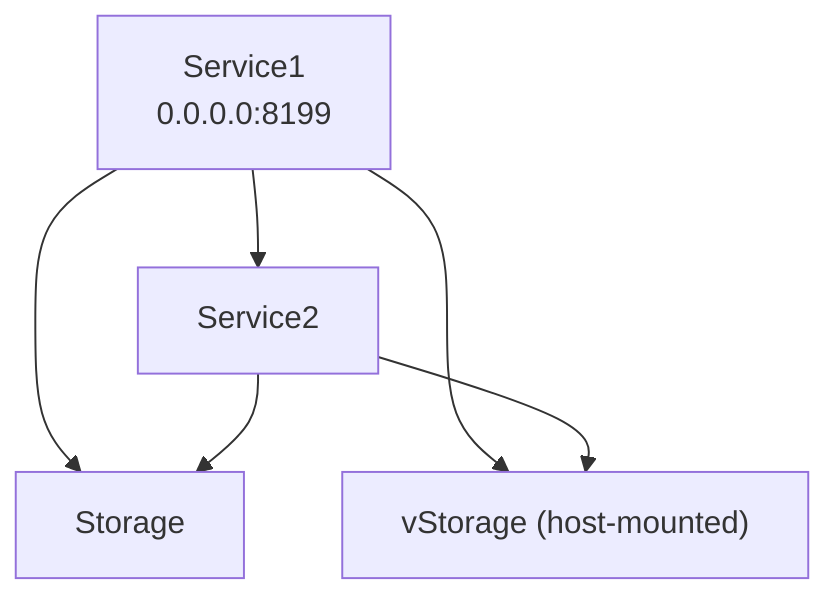

# COMP.SE.140 Exercise1 Report

## 1. Basic Information
- **Hardware / VM:** MacBook Air M2
- **OS:** macOS 12.5
- **Docker Version:** 24.0.5
- **Docker Compose Version:** 2.23.1

## 2. Service Diagram

3. Status Record Analysis:
2025-09-29T09:37:38Z: uptime 0.00 hours, free disk in root: 972727 MBytes
2025-09-29T09:37:38Z: uptime 0.00 hours, free disk in root: 972727 MBytes
Observations:

Disk space measured in MB using df /.

Uptime measured in hours using uptime -p.

Each /status request generates two log entries, one per service.

4. Persistent Storage Comparison
Observations:

Both storage solutions persist logs between container restarts.

Outputs from curl localhost:8199/log and cat ./vstorage/log.txt are identical.
5. Instructions for Cleaning Storage:

rm -f ./vstorage/log.txt
docker volume rm compse140-exercise1_vStorage
docker-compose down
docker volume prune

6. Difficulties & Problems

Service1 initially crashed because it used localhost instead of Docker service names (service2, storage).

Debugging container networking was required.

Correct volume mounting for vStorage to persist logs was tricky.

Ensuring both Service1 and Service2 logs were identical and persistent.

7.Docker Status
Containers:
CONTAINER ID   IMAGE                          COMMAND                  STATUS          PORTS                    NAMES
7f277a9ebd80   compse140-exercise1-service1   "python app.py"          Up 34 seconds   0.0.0.0:8199->5000/tcp   compse140-exercise1-service1-1
4f3a8d16a9b0   compse140-exercise1-service2   "docker-entrypoint.s…"   Up 34 seconds                            compse140-exercise1-service2-1
3e3a75b2cc6f   compse140-exercise1-storage    "python app.py"          Up 34 seconds                            compse140-exercise1-storage-1
Networks:
NETWORK ID     NAME                          DRIVER    SCOPE
2ee8c07098b6   bridge                        bridge    local
b75f532c443a   compse140-exercise1_default   bridge    local
544d806fefcb   host                          host      local
e4393ed778da   none                          null      local

